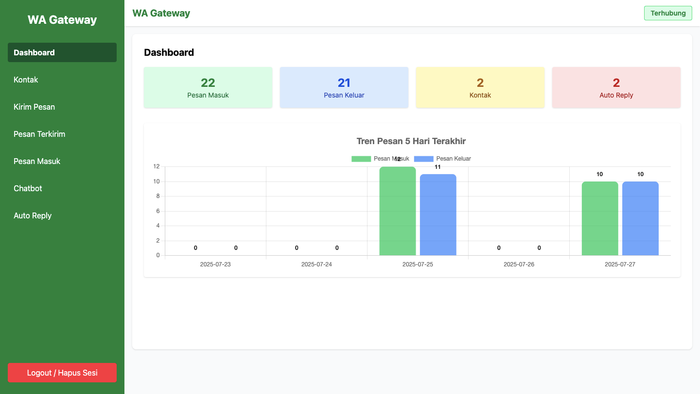

# WhatsApp Gateway Open Source



WhatsApp Gateway adalah aplikasi open source berbasis Node.js (Express, Sequelize, Baileys) dan React yang memungkinkan Anda mengirim, menerima, dan mengelola pesan WhatsApp secara otomatis melalui API dan antarmuka web.

## Tampilan Lainnya


 

 
 
 

## Fitur Utama
- **Login Admin dengan JWT**: Keamanan akses API dan dashboard.
- **Kirim Pesan WhatsApp**: Kirim pesan ke nomor WhatsApp melalui web atau API.
- **Auto Reply Dinamis**: Atur balasan otomatis berbasis keyword.
- **Manajemen Kontak**: CRUD kontak, pilih kontak untuk kirim pesan.
- **DataTable Interaktif**: Tabel pesan masuk, terkirim, auto reply, dan kontak dengan pencarian & pagination.
- **Sidebar & Navbar Responsif**: Navigasi mudah di desktop & mobile.
- **CRUD Pesan Masuk/Terkirim**: Edit & hapus pesan dari dashboard.
- **Integrasi API**: Tes kirim pesan via Postman, PHP, dsb.

## Tested on
1. Node Js v22.17.1
2. Npm 10.9.2
3. MariaDB 10.4.27

## Instalasi

### 1. Clone Repository
```sh
git clone https://github.com/username/wagateway.git
cd wagateway
```

### 2. Backend (Node.js)
```sh
cd backend
npm install
```

#### Konfigurasi User Login
Edit `backend/authConfig.js` untuk mengatur username & password admin.

#### Jalankan Backend
```sh
node index.js
```
Atau gunakan PM2 untuk production:
```sh
npm install -g pm2
pm2 start index.js --name wagateway-backend
```

### 3. Frontend (React)
```sh
cd ../frontend
npm install
```

#### Jalankan Frontend (Development)
```sh
npm start
```

#### Build Frontend (Production)
```sh
npm run build
```
Hasil build ada di folder `frontend/build`.

#### Deploy Frontend
- Copy isi `frontend/build` ke folder public web server (XAMPP/Apache/nginx), atau
- Jalankan dengan `serve`:
  ```sh
  npm install -g serve
  serve -s build -l 3000
  ```

### 4. Setting Koneksi
- Pastikan backend dan frontend mengarah ke IP/domain yang benar (ganti `localhost` di kode jika perlu).
- Pastikan port backend (5000) dan frontend (80/3000) terbuka di firewall/server.

## Penggunaan API
### Login (dapatkan JWT)
```
POST /login
{
  "username": "admin",
  "password": "password"
}
```

### Kirim Pesan WhatsApp
```
POST /send-message
Headers: Authorization: Bearer <JWT_TOKEN>
{
  "to": "628xxxxxxx@s.whatsapp.net",
  "message": "Pesan dari API"
}
```

## Kontribusi
Pull request, issue, dan saran fitur sangat diterima! Silakan fork dan submit PR.

## Lisensi
MIT

---

**Dibuat dengan ❤️ oleh komunitas open source.**
